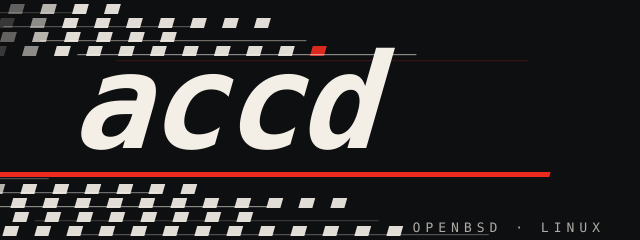

<p align="center">
  
</p>

<p align="center">
  <a href="https://github.com/renaudallard/assettocorsa_competizione_server/releases/latest">
    
  </a>
  <a href="https://github.com/renaudallard/assettocorsa_competizione_server/actions">
    
  </a>
  <a href="https://github.com/renaudallard/assettocorsa_competizione_server/releases">
    
  </a>
  
  
  <a href="LICENSE">
    
  </a>
</p>

<h1 align="center">accd</h1>
<p align="center">
  <b>ACC dedicated server, clean-room reimplementation</b><br/>
  An unmodified Assetto Corsa Competizione client connects and races,<br/>
  on Linux, OpenBSD, or FreeBSD — no Wine, no Kunos binaries.<br/>
  <br/>
  Plus a built-in <b>live telemetry feed</b> over the same TCP port:
  21 kunos-format stdout banners for log scrapers (accweb, custom
  tail scripts) and a protobuf side-channel
  (<code>ServerMonitor v1</code>) for dashboards, with a
  zero-dependency Python CLI client included.
</p>

---

## Contents

- [What works](#what-works)
- [Known limitations](#known-limitations)
- [Building](#building)
- [Running](#running)
  - [Configuration files](#configuration-files)
  - [Starting the server](#starting-the-server)
  - [Firewall / ports](#firewall--ports)
  - [Connecting from the ACC client](#connecting-from-the-acc-client)
  - [Admin console](#admin-console)
  - [Reading live state with smpr-inspect](#reading-live-state-with-smpr-inspect)
  - [Background service](#background-service)
  - [Quick smoke test](#quick-smoke-test)
- [Scope & legal posture](#scope--legal-posture)
- [Repository layout](#repository-layout)
- [Contributing](#contributing)
- [License](#license)

---

## What works

### Connection & handshake

- **TCP framing** with variable-width length prefix; variable-length
  welcome trailer (`0x0b`) built section-for-section to match the
  Kunos layout byte-for-byte.  All 9 reject (`0x0c`) reasons wired
  with the correct sub/detail-a/detail-b tuple per code: 4 KICKED,
  5 BANNED, 6 PASSWORD, 7 VERSION_LO, 8 VERSION_HI, 9 FULL, 10
  CP_RATING, 11 BAD_CAR, 12 BAD_SESSION.
- **Post-accept welcome sequence** — `0x28` large state, `0x36`
  leaderboard, `0x37` weather, `0x4e` rating summary sent in the
  right order and cadence.  Per-connection time-base projection
  (`ts − server_now + client_ts + RTT/2`) for `0x28` schedule
  timestamps.
- **Quick reconnect** by Steam ID drops the old conn and reuses the
  car slot, so race state, grid position, and penalty queue survive
  a mid-race disconnect.  Works both while the old socket is still
  alive and after the inactive-peer sweep removes it.
- **Unique race numbers** enforced on join: a connection requesting
  a number already in use is bumped to `requested+1..+9`, then to
  the smallest free 1..999, then to 999, mirroring the exe's
  allocator in `FUN_140025690`.  Reconnects keep their original
  number.
- **Mid-race join controls** — `unsafeRejoin: 0` refuses fresh
  handshakes during an active race; `/lockprep` freezes the
  preparation phase.  Returning drivers always bypass both.
- **Silent scanner reaper** — a TCP socket that accepts but never
  sends the handshake is dropped after 30 s.  Without the reaper a
  single port scan could pin the session-start gate and trip the
  public lobby's delist filter.

### Session management

- **P / Q / R schedule** with automatic phase transitions, countdown
  timers, overtime hold, and weekend reset after the final race.
- **Position-based race start** — the green flag fires when the
  leader's normalised track position crosses a randomised trigger
  inside the configured green range, with no time fallback.
  Mirrors the exe's two formation variants: `formationLapType: 3`
  (default, matching the exe's constructor) runs the silent path
  (`FUN_14012f300`) with a 1000 ms phase-4 window and no chat.
  `formationLapType: 1` or `4` runs the verbose path
  (`FUN_14012f4a0`) with a uniform 3000-5500 ms phase-4 window and
  a "Race start initialized" system chat (private-server only; the
  exe force-downgrades 1 to 3 on public servers).  The leader is
  also gated on the exe's per-car eligibility check
  (`FUN_1400428d0` + `FUN_1400431e0`): must have reported location
  `Track` via `0x32` and must have driven through the 0.6-0.7
  formation-lap midpoint, so a car still parked in the paddock
  cannot fire the green flag.
- **Race grid from qualy** — race grid derived from the most recent
  prior qualifying session's finishing order.  `defaultGridPosition`
  in `entrylist.json` is used only when no prior Q/P exists.  On the
  formation-to-green transition the server prints a `Race grid:`
  block followed by one `  Car N Pos M` line per slot in pole-first
  order, so the final starting order is visible in the server output
  without needing the client HUD.
- **Ranked leaderboard / results** — real-time standings on lap
  completion, `0x36` broadcast in ranked order, `0x3f` grid at race
  start, `0x3e` session results at session end.
- **Results file writer** — `results/YYMMDD_HHMMSS_<type>.json`
  matching the stock server schema.

### Telemetry & relay

- **Periodic per-car relay** — car updates set a dirty flag on
  ingest; the tick loop fans the dirty set out once per tick
  (~333 Hz, matching `CreateTimerQueueTimer(Period=3)` in the
  exe's `main`) as `0x1e` (or `0x39` count=1 under `/mp` legacy
  netcode), mirroring FUN_14001a170 / FUN_14001a6a0 in
  accServer.exe.  Per-peer timestamp adjustment uses the sender's
  and receiver's last-seen UDP client-timestamps so the relayed
  clock delta is fresh to within one tick.
- **Weather & in-game clock** — deterministic sin/cos weather with
  seeded cycles; 5-second `0x37` broadcast carrying `weekend_time_s`
  driven by `hourOfDay` × `timeMultiplier`.
- **Driver swap** — full endurance-style swap state machine
  (`&swap`, `0x47`/`0x48`/`0x4a`/`0x58`) for multi-driver entries.
- **Live track change** — `/track <name>` swaps the track
  mid-session with `0x4b` welcome redelivery to every client.
- **Live server-side state** — the server receives and tracks
  per-car position, speed, direction, gear, fuel, damage zones,
  lateral G, sector splits, lap times, IsOutLap / HasCut flags,
  in-pit status, mandatory-pit progress, penalty queue, and the
  per-driver swap state on every authenticated connection.  This
  state drives internal logic (penalty serve countdowns,
  mandatory-pit gating) and is exposed to
  external monitoring tools via the ServerMonitor (SMPR) protocol
  below.  Each car_update also carries 8 input bytes whose semantic
  the kunos exe never reveals; we relay them opaquely.  Anything
  outside that frame (tyre temps, suspension travel, detailed
  control traces) stays client-side and never reaches the server.
- **ServerMonitor (SMPR) protobuf side-channel** — accd's
  gameplay `tcpPort` accepts a second protocol distinguished by
  the first body byte (sim handshake `0x09` routes to the regular
  handshake handler; a `ServerMonitorConnectionRequest` protobuf
  starting with the field-1 tag `0x0a` routes to the SMPR
  handler).  The seven push message types from the kunos
  `acc_server_protocol.proto v1` schema (`0x01` REGISTRATION_RESULT,
  `0x02` SERVER_CONFIGURATION, `0x03` SESSION_STATE, `0x04`
  CAR_ENTRY, `0x05` CONNECTION_ENTRY, `0x06` REALTIME_UPDATE,
  `0x07` LEADERBOARD_UPDATE) stream out to each attached client
  with per-client `realtimeCarUpdateInterval` (clamped [50,
  10000] ms).
  Note: accd's demux differs from the kunos exe's (which sets a
  per-connection flag inside the sim handshake handler via an
  unconfirmed string match — see §12B.1 of `NOTEBOOK_B.md`).
  No public hosting tool currently speaks SMPR — accweb and
  accservermanager both parse the server's stdout log instead,
  emperorservers is closed-source — so accd ships its own
  drop-in client at `tools/smpr-inspect/` (stdlib-only Python,
  text / JSON / raw output modes) and a Go-compatible
  log-scraping bridge at `tools/accweb-bridge/`.

### Admin & moderation

- **Chat / console commands**: `/admin`, `/next`, `/restart`,
  `/resetWeekend`, `/kick`, `/ban`, `/dq`, `/tp5`, `/tp15`, `/dt`,
  `/sg10..30` (stop-and-go, always collision), `/clear`, `/cleartp`,
  `/clear_all`, `/ballast`, `/restrictor`, `/track`, `/tracks`,
  `/connections`, `/hellban`, `/lockprep`, `/unlockprep`,
  `/latencymode`, `/manual entrylist`, `/manual start`, `/wt`,
  `/go` / `/start`, `/report`,
  `/broadcast` (aliases `/say`, `/announce`),
  `/debug <conditions|bandwidth|qos>`.  Driver `&` commands: `&swap`,
  `&delta <default|error|diff>`, `&formation`.
- **Penalty system** — per-car queue, mandatory pitstop tracking,
  3-lap deadline countdown for DT/SG with auto-DQ on miss.
  Pit-speeding is detected and reported by the AC2 client (the server
  relays it), matching the dedicated server.
- **Persistent bans** — `/ban` writes to `cfg/banlist.txt` and
  survives restarts; banned Steam IDs are rejected on reconnect.

### Integration

- **LAN discovery** — UDP 8999 broadcast response so clients on the
  same network find the server automatically.
- **Public lobby registration** — `registerToLobby: 1` connects to
  the Kunos lobby backend so the server is listed in the in-game
  server browser.  Set `0` for direct-IP-only private servers.
- **Entry list** — `entrylist.json` populates slots; with
  `forceEntryList: 1`, only listed Steam IDs are accepted.
- **BoP** — `0x53` sent to the affected car on ballast/restrictor changes.
- **Debug tracing** — `-d` flag or `debug` console command enables
  full wire hexdump of every message.
- **OpenBSD support** — builds on OpenBSD 7.9 arm64 (celeborn deploy
  target), runs under `pledge("stdio rpath wpath cpath inet")` +
  `unveil(cfg, results)` after binding ports.
- **Linux sandbox** — on Linux accd applies the equivalent
  `seccomp-BPF` syscall allowlist (matching the pledge surface,
  with `SCMP_ACT_KILL_PROCESS` default) and a `Landlock` ruleset
  scoped to `cfg/` and `results/` (matching unveil).  Both fall
  through gracefully when the kernel or `libseccomp` is missing.
- **Zero idle CPU** — with no clients connected the main loop
  blocks in `poll()` for up to 100 ms per iteration, so the
  daemon sits near 0 % CPU until the first client is accepted
  and the 333 Hz tick resumes.

### Known limitations

- Single-threaded event loop.  The stock Kunos exe is multi-threaded
  (CONCRT worker queue + per-client threads) running at 333 Hz.
  accd matches the 333 Hz cadence with one non-blocking `poll()`
  loop and a 256-packet UDP drain burst, intentionally different
  from the exe's concurrency model but emitting on the same
  wall-clock schedule.  With zero clients connected the loop
  blocks in `poll()` for up to 100 ms so the daemon idles near
  0 % CPU; the 333 Hz busy-wait resumes the instant the first
  client is accepted.
- The CP-server stack in `settings.json` is parsed and stored but
  never acted on (`isCPServer`, `isCPInvServer`, `competitionRating
  Min/Max`, `region`, etc.) — CP servers require the Kunos ranked
  backend we can't reach from a third-party deployment.  Same goes for
  `useGt2Tracks` / `useN24` and `centralEntryListPath`.
- `randomizeTrackWhenEmpty` picks a new random track each time the last
  driver leaves a running session, matching the dedicated server.
  `useIgtDlcTracks` and `useBgtDlcTracks` add the respective GT3 DLC
  tracks to that random pool (oval and the GT4 layout are never picked).

---

## Building

Portable C99, builds with either BSD or GNU `make`, no dependencies
beyond libc + iconv + libm.  Optional dependencies on Linux:
`libbsd-dev` for `arc4random_uniform`, `libseccomp-dev` for the
syscall sandbox.  Each is detected by a link-time probe and the build
proceeds without it if missing.

### Linux

```sh
sudo apt-get install build-essential libbsd-dev libseccomp-dev
cd accd
make
```

Tested on Debian sid aarch64 with `gcc 15.2.0`.  Built with the
standard hardening triad: `-D_FORTIFY_SOURCE=2 -fstack-protector-strong
-Wformat-security -fPIE` on the compile side and `-pie -Wl,-z,relro
-Wl,-z,now -Wl,-z,noexecstack` on the link side, so the resulting
ELF has PIE + full RELRO + BIND_NOW + non-executable stack.

At runtime `accd` drops privileges via `seccomp-BPF` (allowlist of
~70 syscalls mirroring OpenBSD's `pledge("stdio rpath wpath cpath
inet")`) and a `Landlock` ruleset scoped to `cfg/` and `results/`
(mirroring `unveil`).  Both features degrade gracefully if missing
at build or runtime; pre-5.13 kernels skip Landlock with a
`log_warn`, sanitizer builds skip seccomp.

### OpenBSD

```sh
cd accd
make
```

The Makefile auto-detects `/usr/local/include/iconv.h` and links
`-liconv` when iconv is not in libc.  Tested on OpenBSD 7.9 arm64
with `clang 19.1.7`.  After changing a `#include` in any `.c` or
`.h`, run `make depend` to refresh the inline header-dependency
block at the bottom of the Makefile (regression-tested by
`tests/integration/run_makefile_deps_fresh.sh`).

### Install

```sh
cd accd
make install                                     # /usr/local/bin + man1
make install PREFIX=/usr DESTDIR=/tmp/staging    # for packaging
```

See `accd(1)` for the full reference.

---

## Running

### Configuration files

`accd` expects a `cfg/` directory containing JSON files.  Each file
may be UTF-16 LE with a BOM (the format `accServer.exe` writes) or
plain UTF-8 — detection is automatic.

```sh
./accd                           # uses ./cfg/
./accd /path/to/other/cfg        # explicit path
./accd -c /path/to/cfg           # alternative syntax
./accd -d                        # enable debug tracing
./accd -V                        # print version and exit
```

<details>
<summary><b>configuration.json — network</b></summary>

```json
{
    "udpPort": 9231,
    "tcpPort": 9232,
    "maxConnections": 30,
    "statsUdpPort": 0,
    "configVersion": 1
}
```

`statsUdpPort` is optional: when non-zero the server pushes a 1 Hz
`0xbe` state snapshot to `127.0.0.1:<port>` for local monitoring
tools (never routed off loopback).  `0` disables it.

`maxConnections` is also the **upper bound on the advertised slot
count** — see [How many car slots can the server advertise?](#how-many-car-slots-can-the-server-advertise).
If you've configured `maxCarSlots: 30` but `maxConnections: 24`,
the server browser will show 24, not 30.

</details>

<details>
<summary><b>settings.json — identity and policy</b></summary>

```json
{
    "serverName": "My accd server",
    "password": "",
    "adminPassword": "my-admin-pass",
    "spectatorPassword": "",
    "maxCarSlots": 30,
    "allowAutoDQ": 1,
    "registerToLobby": 1,
    "lanDiscovery": 1,
    "useAsyncLeaderboard": 0,
    "unsafeRejoin": 1,
    "ignorePrematureDisconnects": 0,
    "dumpLeaderboards": 0,
    "configVersion": 1
}
```

| Key | Default | Meaning |
|---|---|---|
| `password` | `""` | Required to join as a driver; empty means open. |
| `adminPassword` | `""` | Used in-game via `/admin <pw>` to elevate to admin. |
| `spectatorPassword` | `""` | Admits the client as a carless spectator: no car slot, excluded from the grid/leaderboard and driver count, but receives all broadcasts to watch. |
| `allowAutoDQ` | `1` | `0` caps repeated-cutting escalation at a 30 s stop&go instead of disqualifying.  A failed DT/SG serve still disqualifies, matching the dedicated server (allowAutoDQ gates only the cutting force). |
| `registerToLobby` | `0` | `1` lists the server publicly in the ACC browser. |
| `lanDiscovery` | `1` | `0` closes the UDP 8999 discovery responder, so the server is invisible to the client's LAN and direct-IP find; it stays reachable via lobby registration or a known address and port. |
| `useAsyncLeaderboard` | `0` | Leaderboard fan-out is event-driven (every standings change) in both modes; `1` also runs a 75 s heartbeat on top as a defense-in-depth refresh. |
| `unsafeRejoin` | `1` | `0` refuses fresh mid-race handshakes. |
| `formationLapType` | `3` | Race-start variant (matches exe ctor default). `3` / `5` = silent path (`FUN_14012f300`, 1000 ms phase-4 window, no chat — public-server default). `1` / `4` = verbose path (`FUN_14012f4a0`, random 3000-5500 ms window, "Race start initialized" chat — private servers only; the exe force-downgrades `1` to `3` on public). `2` is rejected and snapped to `3` by both the exe and accd. |
| `isPrepPhaseLocked` | `0` | `1` freezes the preparation phase; returning drivers still pass (same knob as the `/lockprep` admin command). |
| `shortFormationLap` | `0` | `1` shortens the formation lap (parsed and passed through; exe forces `1` on public servers). |
| `writeLatencyFileDumps` | `0` | `1` writes `results/latency_<timestamp>_<P|Q|R>.csv` — per-keepalive row per authenticated conn with `mono_ms,conn_id,steam_id,avg_rtt_ms,clock_offset_ms`.  Rotates at each session boundary. |
| `latencyStrategy` | `0` | Relay-timestamp projection mode: `0` = slewed average-RTT (Mode B, the dedicated-server default), non-zero = min-RTT (Mode A).  Runtime-togglable via `/latencymode`. |
| `doDriverSwapBroadcast` | `1` | `0` suppresses the 0x47 driver-swap-state fan-out; swap progress stays on the swapping car. |
| `ignorePrematureDisconnects` | `0` | `0` force-drops an authenticated client that goes UDP-silent for over 5s; `1` tolerates the silence (no force-drop). |
| `dumpLeaderboards` | `0` | `1` writes snapshots to `results/` on every update. |
| `maxCarSlots` | `10` | Advertised car capacity.  See [How many car slots can the server advertise?](#how-many-car-slots-can-the-server-advertise) for the full chain of clamps: `maxConnections`, the public-MP 30-cap, the rating-gate formula, and the per-track pit count. |
| `trackMedalsRequirement` | `-1` | Minimum track-medals (0..5) to join, or `-1` to leave the server open to unrated players.  On public servers, each medal also adds 1 to the advertised slot cap, up to a maximum of +3.  No effect on private servers.  Set `0` only if you specifically want a ranked-only server (the ACC browser then refuses unrated joiners). |
| `safetyRatingRequirement` | `-1` | Minimum SA rating (0..99) to join, or `-1` to leave open.  On public servers, adds `SA × 0.25` to the advertised slot cap (SA 70 → +17.5, SA 99 → +24.75, bounded by the 30-slot ceiling).  No effect on private servers. |
| `racecraftRatingRequirement` | `-1` | Minimum RC rating (0..99) to join, or `-1` to leave open.  Does NOT affect the advertised slot cap. |
| `maxMonitors` | `max_connections / 4` (min 2) | Cap on simultaneous SMPR observer connections so monitors can't starve sim drivers out of the shared slot pool.  `0` disables observers entirely. |
| `maxMonitorsPerIp` | `2` | Per-source-IP observer cap.  Stops a single host from filling the global observer quota. |

</details>

<details>
<summary><b>event.json — track, weather, schedule</b></summary>

```json
{
    "track": "monza",
    "preRaceWaitingTimeSeconds": 80,
    "sessionOverTimeSeconds": 120,
    "ambientTemp": 22,
    "cloudLevel": 0.1,
    "rain": 0.0,
    "weatherRandomness": 1,
    "formationTriggerNormalizedRangeStart": 0.80,
    "greenFlagTriggerNormalizedRangeStart": 0.89,
    "greenFlagTriggerNormalizedRangeEnd":   0.96,
    "sessions": [
        { "hourOfDay": 12, "dayOfWeekend": 2, "timeMultiplier": 1,
          "sessionType": "P", "sessionDurationMinutes": 10 },
        { "hourOfDay": 14, "dayOfWeekend": 2, "timeMultiplier": 1,
          "sessionType": "Q", "sessionDurationMinutes": 10 },
        { "hourOfDay": 16, "dayOfWeekend": 3, "timeMultiplier": 2,
          "sessionType": "R", "sessionDurationMinutes": 20 }
    ],
    "configVersion": 1
}
```

Session types: `P` (Practice), `Q` (Qualifying), `R` (Race).

The three `formationTrigger*` / `greenFlag*` keys override the built-in
defaults for the position-based race-start gate (normalized track
positions 0..1).  Shown above at the exe's compiled-in fallback
values; leave absent to use them.

</details>

<details>
<summary><b>entrylist.json — optional pre-populated slots</b></summary>

Pre-assigns car entries with driver info, ballast, restrictor, and
grid positions.  If absent, the server accepts any client into the
first available slot.  With `forceEntryList: 1`, only Steam IDs in
the entry list are accepted.

</details>

<details>
<summary><b>Fetching stock Kunos config files via steamcmd</b></summary>

```sh
steamcmd +@sSteamCmdForcePlatformType windows \
         +force_install_dir /path/to/acc-server \
         +login <your steam username> \
         +app_update 1430110 validate +quit
cp -r /path/to/acc-server/server/cfg ./cfg
```

Stock files are UTF-16 LE; `accd` reads them as-is.  To convert to
UTF-8 for hand-editing:

```sh
iconv -f UTF-16LE -t UTF-8 cfg/settings.json | tr -d '\r' > tmp \
  && mv tmp cfg/settings.json
```

</details>

### How many car slots can the server advertise?

The slot count an operator wants to advertise (`maxCarSlots`) is
the result of a chain of clamps.  Both the kunos exe
(`FUN_1400214b0`) and accd apply them in this order:

1. **`maxConnections` cap (`configuration.json`)** — if
   `maxConnections < maxCarSlots`, the advertised count is
   reduced to `maxConnections`.  Operators on hardware-
   constrained hosts (Pi 4, low-RAM VPS) often set
   `maxConnections` lower than they realise and bump into this
   first.  *Always applied, public or private.*
2. **Global 30-cap (public MP only)** — the kunos lobby refuses
   to publish more than 30 slots for any public server.  Private
   servers (`registerToLobby: 0`) are not affected.
3. **Rating-gate formula (public MP only)** — for public servers
   the lobby additionally clamps using
   `min(30, 10 + min(3, trackMedalsRequirement) + safetyRatingRequirement × 0.25)`.
   To reach 30 you need `trackMedalsRequirement: 3` AND
   `safetyRatingRequirement ≥ 68` (kunos's diagnostic says "3 TM
   + 70 SA").  Without rating gates the public cap is 10.
   Private servers skip this clamp entirely.
4. **Pit count (per-track)** — every ACC circuit has a hard pit-
   box count; the lobby clamps the advertised count to it.  Most
   tracks have ≥ 30 pits; the few that don't (short layouts) cap
   below their nominal slot count.

So the practical decision tree:

| What you want | How to configure |
|---|---|
| Advertise N ≤ 10 slots on any server | leave rating gates at 0, set `maxConnections ≥ N` and `maxCarSlots: N` |
| Advertise 11–30 on a **private** server (`registerToLobby: 0`) | set `maxConnections ≥ N` and `maxCarSlots: N`; rating gates don't matter |
| Advertise 11–13 on a **public** server (`registerToLobby: 1`) | add `trackMedalsRequirement: 3` (each medal = +1, max +3) |
| Advertise up to 30 on a **public** server | add `trackMedalsRequirement: 3` + `safetyRatingRequirement: 70` |

`racecraftRatingRequirement` does **not** affect the slot count —
it only gates which drivers can join.  accd mirrors clamps #1,
#2 and #3 locally (#2 and #3 only when `registerToLobby: 1`) so
the server-side count matches the lobby's advertised number.

### Starting the server

```sh
cd accd
./accd
```

```
2026-04-18 08:19:24 INFO accd phase 1 starting (pid 78045)
2026-04-18 08:19:24 INFO config: tcp=9232 udp=9231 max=30 lan=1 track="monza"
2026-04-18 08:19:24 INFO lan discovery listening on udp/8999
2026-04-18 08:19:24 INFO admin console enabled (type 'help' for commands)
2026-04-18 08:19:24 INFO listening: tcp/9232 udp/9231 (Ctrl-C to stop)
```

Stop with `Ctrl-C`, `quit` at the console, or `kill -TERM <pid>`.

### Firewall / ports

| Port | Proto | Purpose |
|-----:|:-----:|---------|
| 9232 | TCP | Game connection (handshake, chat, session data) **and** SMPR (ServerMonitor protobuf) — same listener, demultiplexed at the first frame |
| 9231 | UDP | Car telemetry (position, inputs, timing) |
| 8999 | UDP | Client discovery (required for in-game find) |

Ports 9232 and 9231 are configurable in `configuration.json`; UDP
8999 is fixed by the ACC protocol.  All three must be open.

Purpose-built SMPR monitoring clients (see "ServerMonitor (SMPR)
protobuf side-channel" above) connect to the game TCP port and
send a `ServerMonitorConnectionRequest` protobuf as their first
frame — accd distinguishes them from sim clients automatically.
The bundled `tools/smpr-inspect/smpr-inspect.py` is the reference
implementation; point it at any accd-hosted server to stream live
state in text or NDJSON form.  Firewall the TCP port appropriately
if you do not want public monitoring.

### Connecting from the ACC client

On the client machine:

```
%userprofile%\Documents\Assetto Corsa Competizione\Config\serverList.json
```

(macOS / CrossOver: `~/Documents/Games/Assetto Corsa Competizione/Config/serverList.json`)

```json
{ "leagueServerIP": "192.168.1.100" }
```

The server appears in the in-game multiplayer server list.

### Admin console

When stdin is a TTY, an interactive admin console runs alongside the
server:

```
$ ./accd
help
commands (leading / optional):
  help                show this list
  status              session phase, connections, tick
  show cars           list car slots in use
  show conns          list active connections
  next                advance to next session
  restart             restart current session
  kick <num>          kick car by race number
  ban <num>           kick + persistent ban
  dq <num>            disqualify
  tp5 <num>           5s time penalty (tp5c = collision)
  tp15 <num>          15s time penalty (tp15c)
  dt <num>            drive-through (dtc)
  sg10 <num>          10s stop-and-go (sg10c..sg30c)
  clear <num>         clear penalties for car
  cleartp <num>       clear time penalties only
  clear_all           clear all penalties
  ballast <n> <kg>    assign ballast
  restrictor <n> %    assign restrictor
  track [name]        show or change track
  tracks              list available tracks
  connections         list connections (also broadcasts)
  debug               toggle debug tracing
  quit                shut down the server
```

Leading `/` is optional (both `next` and `/next` work).  Console
replies go to stdout, server logs go to stderr — split with
`./accd 2>accd.log`.

When stdin isn't a TTY (e.g. `./accd < /dev/null` or systemd) the
console disables itself and the server runs headless.  All admin
commands remain available via in-game chat after `/admin <password>`.

### Reading live state with smpr-inspect

`tools/smpr-inspect/smpr-inspect.py` is a drop-in CLI client that
speaks accd's ServerMonitor protobuf side-channel.  Stdlib-only
Python 3 — no `pip install` needed.

```sh
# Live tail (default text output, ~per-tick updates):
tools/smpr-inspect/smpr-inspect.py 127.0.0.1:9232

# NDJSON to a file, capture 60 s for offline analysis:
tools/smpr-inspect/smpr-inspect.py acc.example.com:9232 \
    -o json -t 60 > race.ndjson

# Filter for leaderboard updates only:
tools/smpr-inspect/smpr-inspect.py acc.example.com:9232 -o json \
    | jq -c 'select(.type=="Leaderboard")'

# Wire raw decoded fields into a custom dashboard / Slack bot /
# Prometheus exporter -- one event per JSON line is the API.
tools/smpr-inspect/smpr-inspect.py acc.example.com:9232 -o json \
    | python3 my_dashboard.py
```

The inspector decodes all seven SMPR message types
(`RegistrationResult`, `ServerConfiguration`, `SessionState`,
`CarEntry`, `ConnectionEntry`, `RealtimeUpdate`, `Leaderboard`)
matching the field numbers in `accd/monitor.h`.  See
`tools/smpr-inspect/README.md` for the full CLI reference,
compatibility caveats, and use-case recipes.

Operators who already run [accweb](https://github.com/assetto-corsa-web/accweb)
should look at `tools/accweb-bridge/` instead — that path wraps
accd so accweb's stdout-scraping pipeline picks up the kunos-
format log lines `log_kunos()` emits (see "Telemetry & relay"
above).

### Background service

Quick headless run:

```sh
./accd 2>accd.log &
```

Production: grab a prebuilt artifact from the
[latest release](https://github.com/renaudallard/assettocorsa_competizione_server/releases/latest)
— `.deb` (Ubuntu / Debian), `.rpm` (Fedora / Rocky), the static-musl
`accd-<ver>-linux-static-<arch>.tar.gz` that runs on any Linux distro
regardless of installed libc, or the macOS universal
`accd-<ver>-macos-universal.tar.gz` (an `accd.app` bundle that runs on
both Intel and Apple Silicon).  Every Linux artifact is shipped for
both `amd64` (`x86_64`) and `arm64` (`aarch64`); FreeBSD is amd64-only.
Install the package and use the shipped systemd unit (runs as an
unprivileged dynamic user, sandboxed):

```sh
sudo systemctl enable --now accd
# config files go in /var/lib/accd/cfg/
```

### Quick smoke test

Reject path (wrong protocol version, expect 14-byte `0x0c`):

```sh
printf '\x03\x00\x09\x99\x00' | nc -q 1 127.0.0.1 9232 | xxd
# expects: 0e 00 0c 07 00 00 00 00 99 00 00 00 00 01 00 00
```

Accept path (correct version `0x100`, empty password):

```sh
printf '\x04\x00\x09\x00\x01\x00' | nc -q 1 127.0.0.1 9232 | xxd
# expects: large response starting with 0b 0f 24 ...
```

### Full test suite

```sh
cd accd
make test                                        # python smoke pair
```

For the full integration suite (60+ scripts covering every wire
message — handshake, welcome trailer, lobby protocol, penalty
ladder, driver swap, weather cadence, leaderboard byte-decode,
multi-driver team entries, …) `cd tests/integration && ./run_*.sh`.
Tests that need >60 s (soak, phase-collapse, race-cycle) gate on
`SKIP=1` for CI smoke runs.  accd's wire output is byte-exact
against accServer.exe in the characterised scenarios; the small
documented residue (e.g. `lap_count` counting the formation
crossing) is held intentionally to match the real ACC client's
HUD rather than the exe's strict scoring path.

Four GitHub Actions workflows run on every push:

- **Sanitizers (ASAN/UBSAN/TSAN)** — builds `accd` with clang
  `-fsanitize=address,undefined`, runs the welcome-trailer walker
  through the instrumented binary to catch UAF / leak / OOB /
  signed-overflow.  Sandbox self-disables under the sanitizer build.
- **Fuzz** — 60-s libFuzzer harness of `json_parse` seeded from the
  project's own `cfg/*.json`.
- **Autorelease** — on `VERSION` bumps, creates a GitHub release
  and chains the Release Packages workflow.
- **Release Packages** — fans out across Debian / Ubuntu / Fedora /
  Rocky / Alpine / static-musl / macOS-universal / FreeBSD targets,
  builds amd64 + arm64 (Linux), and uploads the binaries / .deb /
  .rpm / .tar.gz artifacts to the release.

---

## Scope & legal posture

- **In scope**: private-multiplayer gameplay against the stock ACC
  client, running on Linux, OpenBSD, or FreeBSD, without Wine.
- **Out of scope**: the Community Competition rating / competition-
  point system, and anything that requires running Kunos code.

<details>
<summary><b>Legal posture (EU Directive 2009/24/EC, Article 6)</b></summary>

This is an independent-program reimplementation pursued for
**interoperability** purposes only, relying on the carve-out in
Article 6 of EU Directive 2009/24/EC on the legal protection of
computer programs, which permits reverse engineering of a computer
program when necessary to obtain the information needed to achieve
interoperability of an independently created program.

- You must own a legitimate copy of Assetto Corsa Competizione on
  Steam to make any use of this project.
- This repository ships **no Kunos code and no Kunos assets** — only
  an independent clean-room specification and an independent
  implementation.
- The specification in `notebook-b/` is derived exclusively from
  public documentation shipped by Kunos with the ACC Dedicated
  Server Steam tool (app 1430110) and from observations rewritten
  in the author's own words.
- A separate working set of dirty notes exists locally for
  reverse-engineering use during development.  These are gitignored
  and **never published**; only the clean-room specification is
  public.

</details>

---

## Repository layout

<details>
<summary>Tree</summary>

```
.
├── README.md                This file.
├── LICENSE                  BSD-2-Clause license.
├── VERSION                  Version number (triggers releases).
├── notebook-b/
│   └── NOTEBOOK_B.md        The public clean-room protocol spec.
├── accd/                    The C implementation (29 modules).
│   ├── main.c               Poll loop + signal handling + lifecycle.
│   ├── bans.{c,h}           Persistent kick / ban list.
│   ├── bcast.{c,h}          Broadcast helpers (TCP + UDP relay).
│   ├── chat.{c,h}           Admin chat commands + penalty dispatch.
│   ├── config.{c,h}         JSON config reader (UTF-16 LE or UTF-8).
│   ├── console.{c,h}        stdin admin console (poll-driven).
│   ├── dispatch.{c,h}       TCP / UDP message dispatchers.
│   ├── entrylist.{c,h}      entrylist.json reader.
│   ├── handlers.{c,h}       Per-msg-id handlers (22 TCP + 7 UDP).
│   ├── handshake.{c,h}      ACP_REQUEST_CONNECTION + 0x0b + welcome.
│   ├── io.{c,h}             Byte buffer + TCP framing layer.
│   ├── json.{c,h}           Recursive-descent JSON parser.
│   ├── lan.{c,h}            UDP 8999 LAN discovery handler.
│   ├── lobby.{c,h}          Kunos public-lobby client.
│   ├── log.{c,h}            Timestamped logger + hexdump.
│   ├── monitor.{c,h}        ServerMonitor protobuf message builders.
│   ├── msg.h                All message id constants + enums.
│   ├── net.{c,h}            tcp_listen / udp_bind helpers.
│   ├── pb.{c,h}             Minimal protobuf encoder + decoder.
│   ├── penalty.{c,h}        Per-car penalty queue.
│   ├── prim.{c,h}           Primitive readers / writers + strings.
│   ├── probe.c              Standalone protocol probe tool.
│   ├── ratings.{c,h}        Persistent SA/TR rating ledger.
│   ├── results.{c,h}        Session results JSON writer.
│   ├── sandbox.{c,h}        pledge/unveil (OpenBSD), seccomp/Landlock (Linux).
│   ├── session.{c,h}        Session phase machine + standings sort.
│   ├── smpr.{c,h}           ServerMonitor protobuf protocol handler.
│   ├── state.{c,h}          Per-conn / global server state structs.
│   ├── tick.{c,h}           Event-driven relay + periodic broadcasts.
│   ├── weather.{c,h}        Deterministic sin/cos weather simulator.
│   └── Makefile
│   ├── tests/
│   │   ├── smoke_handshake.py      python wire-level smoke
│   │   ├── smoke_reject_codes.py   reject-code matrix
│   │   ├── fake_client.py          11-anchor welcome-trailer walker
│   │   └── integration/            65 shell-driven integration tests
│   └── fuzz/
│       └── fuzz_json.c             libFuzzer harness for json_parse
├── tools/
│   ├── accweb-bridge/       accServer.exe-shaped wrapper that lets
│   │                        the upstream `accweb` web manager drive
│   │                        accd unchanged (see README inside).
│   ├── bot/                 Local sim-client simulator used by the
│   │                        integration tests.  `bot.c` drives the
│   │                        wire path with realistic input_a/b
│   │                        bytes derived from per-tick physics;
│   │                        defaults to a synthetic stadium loop
│   │                        when no `--track` CSV is supplied.
│   └── smpr-inspect/        Drop-in Python CLI client for accd's
│                            SMPR protobuf side-channel.  Text or
│                            NDJSON output; stdlib-only.
├── debian/                  Debian/Ubuntu packaging.
├── redhat/                  Fedora/Rocky RPM spec.
└── .github/workflows/       CI: autorelease, release-packages
                             (Ubuntu / Debian / Fedora / Rocky /
                             Alpine / static-musl / macOS /
                             FreeBSD; amd64 + arm64 on Linux),
                             sanitizers (ASAN + UBSAN + TSAN),
                             fuzz (libFuzzer for json).
```

</details>

29 modules, ~24,100 lines of portable C99.  No dependencies beyond
libc, iconv, and libm; on Linux `libbsd-dev` (for `arc4random_uniform`)
and `libseccomp-dev` (for the syscall sandbox) are recommended.
Releases ship `.deb` (Ubuntu / Debian), `.rpm` (Fedora / Rocky), an
Alpine `.tar.gz`, a static-musl Linux `.tar.gz` that runs on any
distro, a macOS universal `.tar.gz` (Intel + Apple Silicon `accd.app`),
and a FreeBSD `.tar.gz` — amd64 and arm64 for every Linux target,
universal for macOS, amd64 only for FreeBSD.  All artifacts carry a
published `SHA256SUMS` for integrity verification.

---

## Contributing

This project follows strict clean-room discipline.  Before
contributing, read **§ 0** of
[`notebook-b/NOTEBOOK_B.md`](notebook-b/NOTEBOOK_B.md).  In short:

- Every fact in the public spec must trace to a public source:
  handbook, SDK, changelog, default configs, shipped sample logs.
- Static or dynamic analysis of `accServer.exe` is kept in your own
  private dirty-notes directory (`notebook-a/` by convention,
  gitignored) and **never committed**.
- Facts promoted to the public spec must be rewritten, in your own
  words, as protocol-level statements about what bytes go on the
  wire — not as statements about any particular implementation.

---

## License

[BSD-2-Clause](LICENSE).  The clean-room specification in
`notebook-b/` is published under the same terms.

Nothing in this repository is authored, endorsed, or licensed by
Kunos Simulazioni or 505 Games.

---

## Support this project

If you find accd useful, you can support development:

[](https://www.paypal.me/RenaudAllard)
